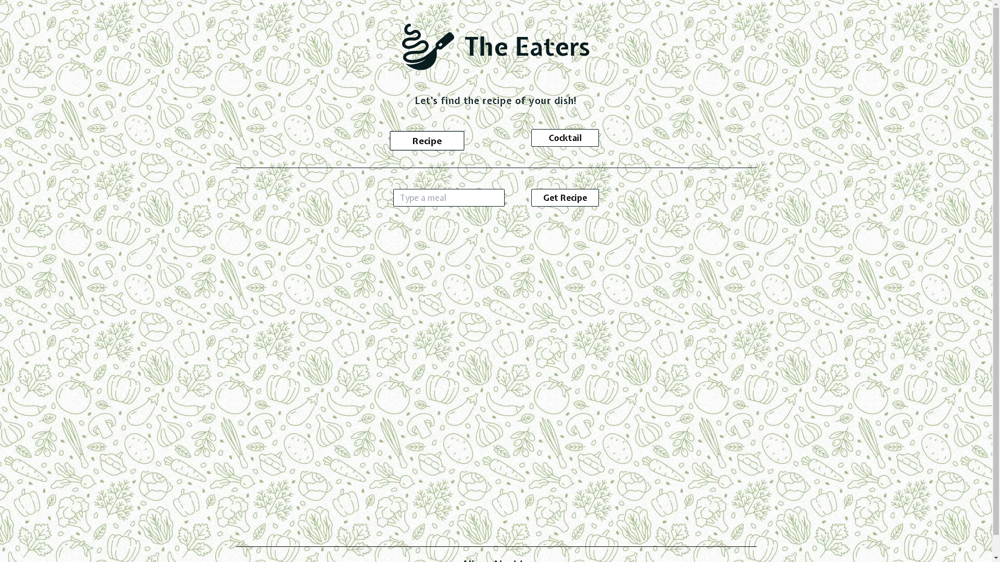

# The Eaters

The Eaters is a simple and user-friendly website that provides you with the recipes of the given dish or cocktail. With The Eaters, you can easily learn how to create a dish of your choice!

## Features

- **Dish Recipes:** With The Eaters, you can find recipe of your desired dish.

- **Cocktail Recipes:** With The Eaters, you can find recipe of your desired cocktail.

- **Cocktail Image:** The Eaters includes an image of desired cocktail as well.

## Getting started

To get started with the Eaters, simply visit the website at [www.theeaters.vercel.app](https://theeaters.vercel.app/) and enter your desired dish or cocktail in the search bar. The Eaters will display the recipe!

## Note

* This is not the final version of the project and changes are expected to be made in the future.
* Images may be misleading because of the Unsplash Image API in this project. It doesn't seem to give proper images everytime.
 
